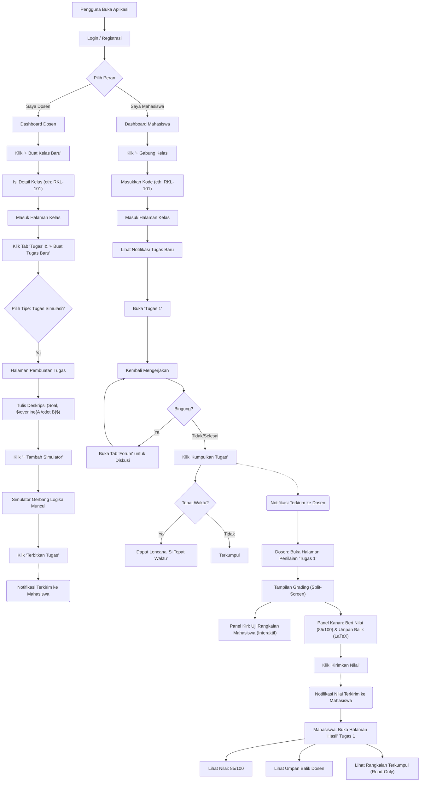

```mermaid
graph TD
    %% 1. ONBOARDING
    A[Pengguna Buka Aplikasi] --> B[Login / Registrasi]
    B --> C{Pilih Peran}

    %% 2. ALUR DOSEN (Membuat & Menilai)
    C -- "Saya Dosen" --> D[Dashboard Dosen]
    D --> E[Klik '+ Buat Kelas Baru']
    E --> F["Isi Detail Kelas (cth: RKL-101)"]
    F --> G[Masuk Halaman Kelas]
    
    G --> H[Klik Tab 'Tugas' & '+ Buat Tugas Baru']
    H --> I{Pilih Tipe: Tugas Simulasi?}
    I -- Ya --> J[Halaman Pembuatan Tugas]
    J --> K["Tulis Deskripsi (Soal, $\overline{A \cdot B}$)"]
    K --> L[Klik '+ Tambah Simulator']
    L --> M[Simulator Gerbang Logika Muncul]
    M --> N[Klik 'Terbitkan Tugas']
    N -.-> O(Notifikasi Terkirim ke Mahasiswa)

    %% 3. ALUR MAHASISWA (Mengerjakan & Melihat)
    C -- "Saya Mahasiswa" --> P[Dashboard Mahasiswa]
    P --> Q[Klik '+ Gabung Kelas']
    Q --> R["Masukkan Kode (cth: RKL-101)"]
    R --> S[Masuk Halaman Kelas]
    
    S --> T[Lihat Notifikasi Tugas Baru]
    T --> U[Buka 'Tugas 1']
    U --> V[Mengerjakan Rangkaian di Simulator Tertanam]
    
    %% Loop Opsional: Forum
    V --> V_Loop{Bingung?}
    V_Loop -- Ya --> V_Forum[Buka Tab 'Forum' untuk Diskusi]
    V_Forum --> V[Kembali Mengerjakan]
    V_Loop -- Tidak/Selesai --> W[Klik 'Kumpulkan Tugas']
    
    %% Alur Gamifikasi Sederhana
    W --> W_G{Tepat Waktu?}
    W_G -- Ya --> W_L[Dapat Lencana 'Si Tepat Waktu']
    W_G -- Tidak --> W_X[Terkumpul]

    %% 4. PENGHUBUNG KEMBALI (Lifecycle)
    
    %% Mahasiswa Mengumpulkan -> Dosen Menilai
    W -.-> X(Notifikasi Terkirim ke Dosen)
    X --> Y["Dosen: Buka Halaman Penilaian 'Tugas 1'"]
    Y --> Z["Tampilan Grading (Split-Screen)"]
    Z --> ZA["Panel Kiri: Uji Rangkaian Mahasiswa (Interaktif)"]
    Z --> ZB["Panel Kanan: Beri Nilai (85/100) & Umpan Balik (LaTeX)"]
    ZB --> ZC[Klik 'Kirimkan Nilai']
    
    %% Dosen Mengirim Nilai -> Mahasiswa Melihat Hasil
    ZC -.-> ZD(Notifikasi Nilai Terkirim ke Mahasiswa)
    ZD --> ZE["Mahasiswa: Buka Halaman 'Hasil' Tugas 1"]
    ZE --> ZF["Lihat Nilai: 85/100"]
    ZE --> ZG["Lihat Umpan Balik Dosen"]
    ZE --> ZH["Lihat Rangkaian Terkumpul (Read-Only)"]
    
   
```